# 🎯 Flujo de Configuración de Rimi - Setup Flow

## Descripción

Modal de configuración inicial que aparece la primera vez que el usuario interactúa con Rimi después de completar el onboarding.

## Flujo Completo

### 1. Onboarding Completado
```typescript
// Usuario completa Smart Health Check
updateUser({ isFirstTime: false });
localStorage.setItem('rimiapp_tutorial_pending', 'true');
navigate('/', { replace: true });
```

### 2. Tutorial en HomePage
```typescript
// HomePage detecta tutorial pendiente
const tutorialPending = localStorage.getItem('rimiapp_tutorial_pending');
if (tutorialPending === 'true') {
  setShowTutorial(true);
}

// Muestra:
// - Backdrop oscuro (z-40)
// - Speech bubble flotante (z-50)
// - Tarjetas bloqueadas
// - Logout bloqueado
```

### 3. Click en Rimi (Primera Vez)
```typescript
// MainLayout.toggleOpen()
const tutorialPending = localStorage.getItem('rimiapp_tutorial_pending');
if (tutorialPending === 'true' && !showSetup) {
  setShowSetup(true); // Muestra modal de configuración
} else {
  setIsOpen(!isOpen); // Abre chat normal
}
```

### 4. Modal de Configuración
```typescript
// SetupModal se renderiza
<SetupModal onComplete={handleSetupComplete} />

// Usuario selecciona preferencia
onComplete('voice' | 'text')
```

### 5. Completar Setup
```typescript
const handleSetupComplete = (preference) => {
  // 1. Guardar preferencia
  localStorage.setItem('rimiapp_communication_preference', preference);
  
  // 2. Cerrar setup
  setShowSetup(false);
  
  // 3. Completar tutorial
  localStorage.removeItem('rimiapp_tutorial_pending');
  if (window.closeTutorial) {
    window.closeTutorial();
  }
  
  // 4. Abrir chat
  setIsOpen(true);
};
```

### 6. Chat Abierto
```typescript
// ChatModal se renderiza
<ChatModal toggleOpen={() => setIsOpen(false)} />

// Usuario puede chatear normalmente
```

---

## Componente SetupModal

### Props
```typescript
interface SetupModalProps {
  onComplete: (preference: 'voice' | 'text') => void;
}
```

### Diseño

**Contenedor:**
- Fixed, centrado
- z-index: 60 (por encima de todo)
- Backdrop: `bg-secondary/80 backdrop-blur-sm`
- Modal: `bg-surface rounded-3xl shadow-2xl`
- Max width: `max-w-md`
- Padding: `p-8`

**Título:**
```typescript
<h2>¿Cómo prefieres comunicarte conmigo?</h2>
<p>Elige tu método preferido para interactuar con Rimi</p>
```

**Opciones:**

1. **Voz**
   - Icono: `<Mic />` (lucide-react)
   - Color: Primary (rojo)
   - Título: "Voz"
   - Descripción: "Ideal para hablar rápido y obtener respuestas inmediatas"
   - Hover: `scale: 1.02`
   - Tap: `scale: 0.98`

2. **Texto**
   - Icono: `<Keyboard />` (lucide-react)
   - Color: Accent (morado)
   - Título: "Texto"
   - Descripción: "Chat silencioso perfecto para cualquier momento"
   - Hover: `scale: 1.02`
   - Tap: `scale: 0.98`

### Animaciones

**Entrada:**
```typescript
initial={{ opacity: 0 }}
animate={{ opacity: 1 }}
exit={{ opacity: 0 }}

// Modal
initial={{ scale: 0.9, opacity: 0 }}
animate={{ scale: 1, opacity: 1 }}
transition={{ type: 'spring', damping: 25, stiffness: 300 }}
```

**Botones:**
```typescript
whileHover={{ scale: 1.02 }}
whileTap={{ scale: 0.98 }}
```

---

## localStorage Keys

### rimiapp_tutorial_pending
- **Tipo**: string ('true' | null)
- **Propósito**: Indica si el tutorial está pendiente
- **Creado**: Al completar onboarding
- **Eliminado**: Al completar setup

### rimiapp_communication_preference
- **Tipo**: string ('voice' | 'text')
- **Propósito**: Guarda la preferencia de comunicación del usuario
- **Creado**: Al seleccionar opción en setup
- **Uso futuro**: Determinar modo de chat por defecto

---

## Estados en MainLayout

```typescript
const [isOpen, setIsOpen] = useState(false);        // Chat abierto
const [showSetup, setShowSetup] = useState(false);  // Setup visible
```

### Lógica de Estados

| Tutorial Pending | showSetup | isOpen | Resultado |
|-----------------|-----------|--------|-----------|
| true | false | false | Mostrar tutorial |
| true | true | false | Mostrar setup modal |
| false | false | false | Normal (cerrado) |
| false | false | true | Chat abierto |

---

## Secuencia de Eventos

```mermaid
graph TD
    A[Onboarding Completado] --> B[HomePage con Tutorial]
    B --> C[Click en Rimi]
    C --> D{Tutorial Pending?}
    D -->|Sí| E[Mostrar Setup Modal]
    D -->|No| F[Abrir Chat]
    E --> G[Usuario Selecciona]
    G --> H[Guardar Preferencia]
    H --> I[Cerrar Setup]
    I --> J[Completar Tutorial]
    J --> K[Abrir Chat]
```



---

## Testing

### Caso 1: Primera Vez Completo
```typescript
// 1. Login
login('123456789', 'usuario')

// 2. Onboarding
completeOnboarding()
// → localStorage.rimiapp_tutorial_pending = 'true'

// 3. HomePage
// → Tutorial visible

// 4. Click Rimi
clickRimiAvatar()
// → Setup modal aparece

// 5. Seleccionar Voz
clickVoiceOption()
// → localStorage.rimiapp_communication_preference = 'voice'
// → Tutorial completado
// → Chat abierto
```

### Caso 2: Usuario Regular
```typescript
// Usuario ya pasó setup
localStorage.rimiapp_tutorial_pending = null

// Click Rimi
clickRimiAvatar()
// → Chat abre directamente
```

### Caso 3: Cambiar Preferencia
```typescript
// Usuario quiere cambiar de voz a texto
// TODO: Implementar en configuración de usuario
```

---

## Próximas Mejoras

- [ ] Permitir cambiar preferencia desde configuración
- [ ] Implementar modo voz real (reconocimiento de voz)
- [ ] Animación de transición entre setup y chat
- [ ] Recordar preferencia en backend
- [ ] Mostrar preferencia actual en perfil de usuario
- [ ] Opción "Recordar mi elección"
- [ ] Poder saltar el setup (usar texto por defecto)

---

## Código de Referencia

### SetupModal.tsx
```typescript
import { motion } from 'framer-motion';
import { Mic, Keyboard } from 'lucide-react';

interface SetupModalProps {
  onComplete: (preference: 'voice' | 'text') => void;
}

export function SetupModal({ onComplete }: SetupModalProps) {
  return (
    <motion.div className="fixed inset-0 z-60">
      <motion.div className="bg-surface rounded-3xl">
        <h2>¿Cómo prefieres comunicarte conmigo?</h2>
        
        <button onClick={() => onComplete('voice')}>
          <Mic /> Voz
        </button>
        
        <button onClick={() => onComplete('text')}>
          <Keyboard /> Texto
        </button>
      </motion.div>
    </motion.div>
  );
}
```

### MainLayout.tsx
```typescript
const [showSetup, setShowSetup] = useState(false);

const toggleOpen = useCallback(() => {
  const tutorialPending = localStorage.getItem('rimiapp_tutorial_pending');
  if (tutorialPending === 'true' && !showSetup) {
    setShowSetup(true);
  } else {
    setIsOpen(!isOpen);
  }
}, [isOpen, showSetup]);

const handleSetupComplete = (preference: 'voice' | 'text') => {
  localStorage.setItem('rimiapp_communication_preference', preference);
  setShowSetup(false);
  localStorage.removeItem('rimiapp_tutorial_pending');
  if (window.closeTutorial) window.closeTutorial();
  setIsOpen(true);
};
```
